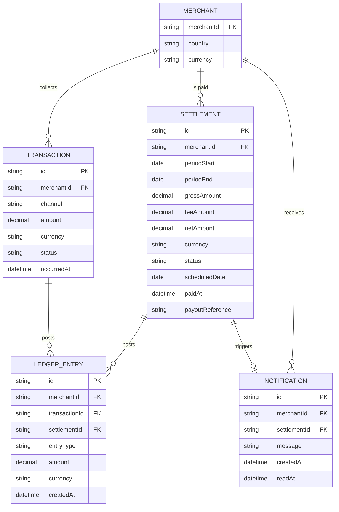

# Domain Model

The core entities this platform owns: the transactions it collects, the
double-entry ledger it keeps, the settlements it pays out, and the
notifications it sends. `Merchant` here is a local reference row keyed to the
merchant identity system's own merchant id — this platform never owns
identity, trading eligibility, payout account, or credit limit.

- **Transaction**: one customer collection over mobile money or card.
- **LedgerEntry**: a double-entry posting against a transaction or a
settlement (debit/credit), the audit trail behind every net amount.
- **Settlement**: one payout cycle for a merchant — gross collected, fee
deducted, net paid, and when.
- **Notification**: an in-app message, generated when a settlement completes.

