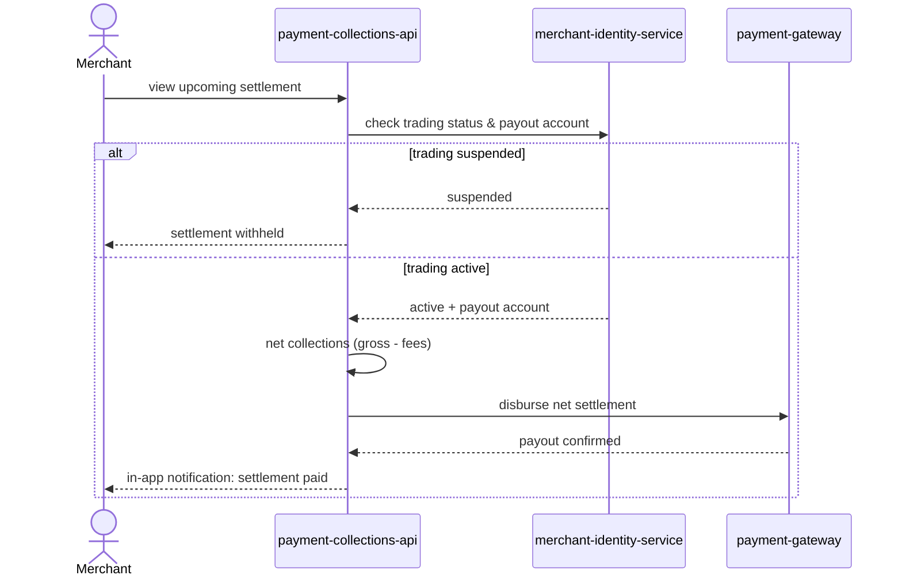

# Daily settlement and payout

A Merchant checks their upcoming settlement; the platform gates it on trading
status held by the merchant identity system, nets the collected amount, and
disburses through the payment gateway before notifying the Merchant.

