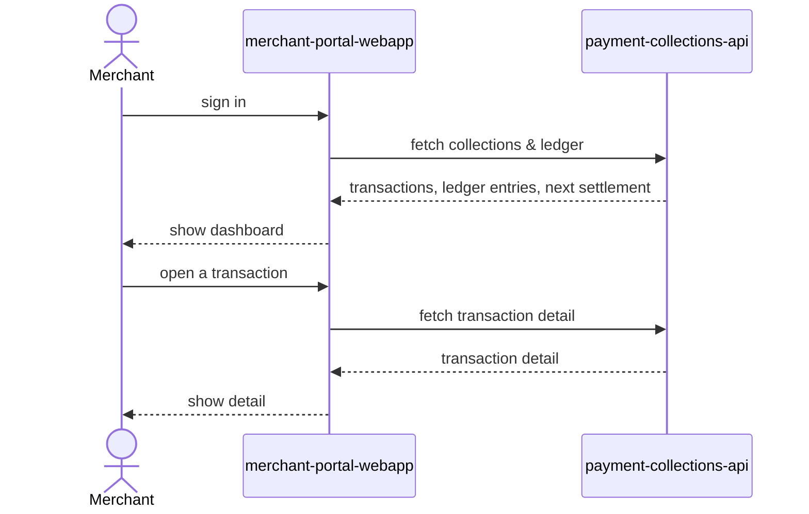

# Merchant reviews collections and ledger

A signed-in Merchant checks what has been collected, how the ledger nets out,
and drills into a single transaction's detail.

```mermaid
sequenceDiagram
    actor Merchant
    participant webapp as merchant-portal-webapp
    participant api as payment-collections-api

    Merchant->>webapp: sign in
    webapp->>api: fetch collections & ledger
    api-->>webapp: transactions, ledger entries, next settlement
    webapp-->>Merchant: show dashboard
    Merchant->>webapp: open a transaction
    webapp->>api: fetch transaction detail
    api-->>webapp: transaction detail
    webapp-->>Merchant: show detail
```

